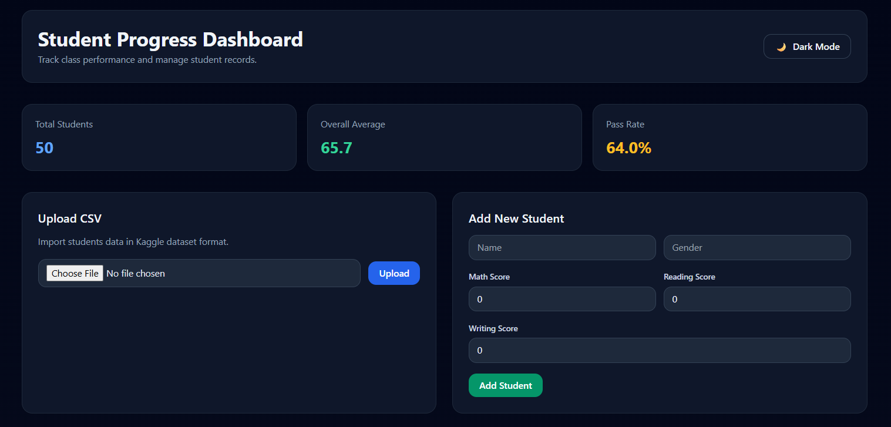
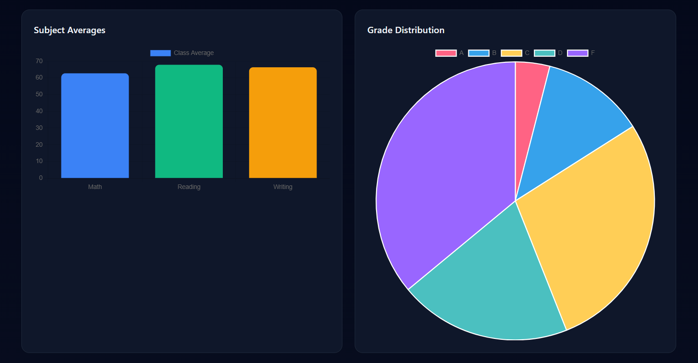
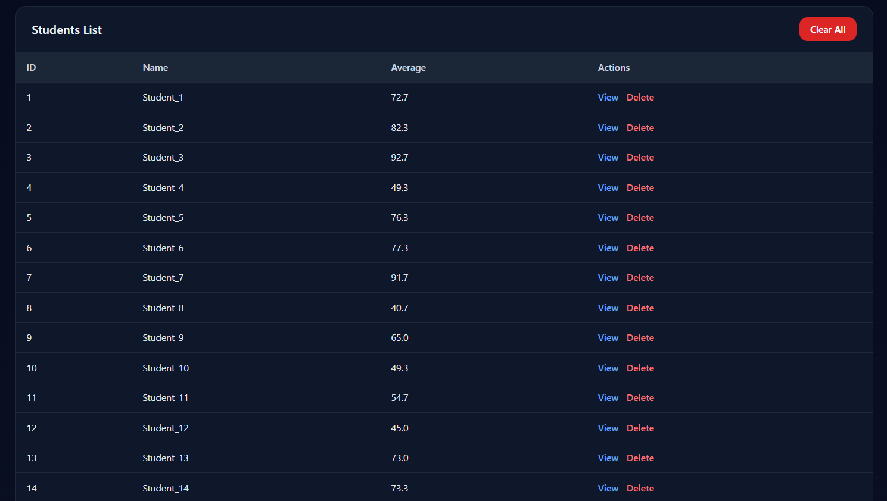

# 📊 EduTrack – Student Progress Dashboard

**A full-stack web application for visualizing and analyzing student exam performance**

## Problem Statement

Educators and teachers frequently rely on spreadsheets or manual calculations to analyze student exam results. This approach is time-consuming, error-prone, and lacks interactivity making it difficult to:

- Quickly identify class-wide trends (e.g., which subjects need improvement?)
- Understand grade distributions and pass/fail rates
- Spot struggling or top-performing students
- Compare performance across demographic groups (gender, test preparation, etc.)
- Provide students with clear visual feedback on their performance relative to the class

These limitations reduce efficiency, delay insights, and hinder timely interventions.

## 🎯 Purpose

EduTrack is a modern, browser-based tool designed to simplify student performance analysis by transforming raw exam data into **interactive, visual, and actionable insights**.

It serves as both a practical utility for teachers/tutors and a strong portfolio demonstration of full-stack development combined with data analytics.

## 🚀 Objectives

- Enable fast ingestion of student exam data through CSV upload or manual entry
- Provide real-time class-level analytics and visualizations
- Offer individual student performance views with comparison to class averages
- Deliver a clean, responsive, and intuitive user interface
- Showcase modern full-stack skills: React frontend, Flask backend, Pandas data processing, RESTful APIs, and deployment
- Create a deployable, production-ready application suitable for educational use or portfolio showcase

## ✨ Features

- CSV bulk upload (compatible with Kaggle "Students Performance in Exams" dataset)
- Manual add/edit/delete of student records
- Class summary cards: total students, overall average, subject averages, pass rate
- Interactive charts:
  - Bar chart – average scores by subject
  - Pie chart – grade distribution (A/B/C/D/F)
- Students table with sorting and actions
- Individual student detail page with personal score visualization
- Responsive design (mobile + desktop)
- Deployed frontend (static) + backend (API) architecture

## 🧰 Tech Stack

**Frontend**
- React (Vite)
- Tailwind CSS
- Chart.js
- Axios

**Backend**
- Flask (Python)
- SQLAlchemy + SQLite
- Pandas (analytics & CSV processing)


## 📂 Project Structure

```student-progress-dashboard/
├── backend/                    # Flask API + data layer
│   ├── app.py
│   ├── database.py
│   ├── models.py
│   ├── crud.py
│   ├── requirements.txt
│   ├── Procfile
│   └── StudentsPerformance.csv   # optional sample
├── frontend/                   # React + Vite app
│   ├── src/
│   │   ├── App.jsx
│   │   └── ...
│   ├── public/
│   ├── package.json
│   ├── vite.config.js
│   └── tailwind.config.js
├── README.md
└── .gitignore
 ```

 
## ⚙️ Getting Started

### Prerequisites

- Python 3.8+
- Node.js 18+ & npm

### Backend

```bash
cd backend
python -m venv venv
venv\Scripts\activate          # Windows
# source venv/bin/activate     # macOS/Linux
pip install -r requirements.txt
python app.py
```
### Frontend
```bash
cd frontend
npm install
npm run dev
```
## Screenshots

🏠 Dashboard Overview




## 🔮 Future Enhancements

- User authentication & roles
- Multiple exams / time-series progress tracking
- PostgreSQL for persistent free-tier hosting
- Export reports (PDF/CSV)

